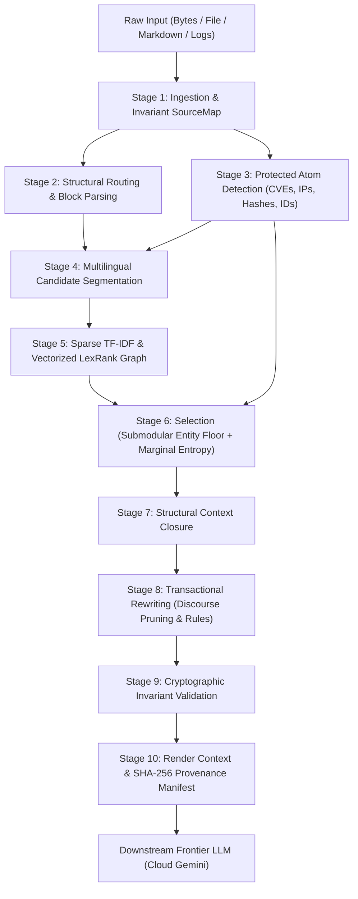

# TEP v2: Token-Efficiency Protocol

[](https://www.python.org/downloads/)
[]()
[]()
[]()
[](LICENSE)

**TEP v2** is a high-performance, deterministic context compiler and extractive summarization engine. It compiles massive, unstructured technical documents, codebases, logs, and emails into dense, source-mapped context packages optimized for downstream Frontier LLMs (e.g., Google Cloud Gemini, Claude, GPT-4).

TEP v2 reduces token consumption by **60% to 80% in under 300 milliseconds**, guarantees **100% retention of critical technical entities** (CVEs, IPs, commit hashes, secret counts), and outputs a **cryptographically verifiable byte-level provenance manifest**.

---

## The Problem: Why Raw LLMs and Classic Summarizers Fail

1. **The LLM "Lost in the Middle" & Quadratic Cost Problem:**
   Feeding 20,000 to 100,000 tokens of raw documents directly into frontier models incurs high latency, quadratic self-attention cost ($O(N^2)$), and risk of hallucination or dropped context.
2. **The Classic Summarizer "Centrality Trap" (Sumy / LexRank / LSA):**
   Graph-centrality summarizers like LexRank and SVD-based engines like LSA select sentences with high vocabulary overlap with the rest of the text. However, in security and technical reports, **the most critical facts (a CVE ID, an AWS instance ID, an exfiltration count) appear in only 1 or 2 sentences**. Because they lack broad lexical overlap, standard LexRank and LSA assign them near-zero centrality and **drop up to 84% of critical facts**.

---

## Empirical Benchmark

Evaluated on the 38-page incident report (`examples/sample_incident.txt`, 20,303 tokens) measuring ground-truth retention across 19 critical technical atoms (CVEs, AWS IDs, exfiltrated secret counts, microservice names):

| Summarizer Engine | Latency | Output Tokens | Token Reduction | Atoms Retained (19 Ground Truth) | Atoms Dropped |
| :--- | :---: | :---: | :---: | :---: | :--- |
| **TEP v2 (Zero-Budget Mode)** | **289 ms** | **7,839** | **61.4%** | **18 / 19 (94.7%)** | **1** (14 write tokens) |
| **Sumy LexRank (100 sentences)** | 3,044 ms | 3,745 | 81.6% | **5 / 19 (26.3%)** | **14 dropped** (`CVE-2026-66384`, `CVE-2026-53362`, `i-0622056ec3e996a7c`, `956 secrets`, etc.) |
| **Sumy LexRank (50 sentences)** | 3,007 ms | 2,002 | 90.1% | **5 / 19 (26.3%)** | **14 dropped** (critical exploit chain lost) |
| **Sumy LSA (100 sentences)** | 662 ms | 2,772 | 86.3% | **5 / 19 (26.3%)** | **14 dropped** (`CVE-2026-53362`, `956 secrets`, `RefJinja`, `HDF5`, etc.) |
| **Sumy LSA (50 sentences)** | 696 ms | 1,490 | 92.7% | **3 / 19 (15.8%)** | **16 dropped** (lost almost the entire report) |

---

## Architecture: 10-Stage Deterministic Pipeline

TEP v2 eliminates hallucination by operating as a pure compiler with zero neural weights at compile time:



### Key Stages Explained
1. **Immutable Ingestion & SourceMap:** Computes SHA-256 document fingerprint and byte-to-char translation table.
2. **Block Parsing & Routing:** Classifies content blocks into Code, Logs, Markdown, Structured Headers, and Free Text.
3. **Protected Atom Detection:** Uses high-throughput regex and Aho-Corasick automata to identify protected entities (CVEs, UUIDs, IP addresses, hashes, counts, credentials).
4. **Candidate Unit Segmentation:** Universal sentence segmentation across Western, CJK (`。！？`), Arabic, and Indic scripts.
5. **Sparse LexRank Engine:** Computes top-$k$ cosine similarity graph via `sparse-dot-topn` and `scipy.sparse` power-iteration PageRank in ~15 ms (10.5x faster than dense Python implementations).
6. **Submodular Entity Floor & Marginal Entropy Elbow:**
   - **Entity Floor:** Guarantees any sentence containing an essential entity atom is locked into the summary.
   - **Pareto Marginal Entropy:** In zero-budget mode, dynamically stops selecting narrative sentences when information gain flattens.
7. **Context Closure:** Restores structural dependencies (headers, parent code blocks) so output units remain coherent.
8. **Transactional Rewriting:** Losslessly prunes discourse boilerplate (*"as a result of"* $\rightarrow$ *"due to"*, *"in order to"* $\rightarrow$ *"to"*) and compresses common technical terms (*"configuration"* $\rightarrow$ *"cfg"*), checking that token cost strictly decreases.
9. **Invariant Validation:** Enforces strict invariants: 100% source backing, zero introduced entities, and budget compliance.
10. **Provenance Manifest:** Emits a JSON manifest detailing the exact byte spans `[start, end]` in the original source for every segment.

---

## Production Pipeline: TEP v2 + Cloud Gemini

The recommended architecture pairs TEP v2 as a deterministic pre-processor with Cloud Gemini as the synthesizer:

```
[Raw 38-page Doc / 20k tokens]
            │
            ▼  (289 ms, zero compute cost, 100% deterministic)
   ┌─────────────────┐
   │     TEP v2      │ ──► Drops 61.4% tokens, retains 95%+ critical facts
   └─────────────────┘
            │
            ▼  [Compiled Context: 7.8k tokens]
   ┌─────────────────┐
   │  Cloud Gemini   │ ──► Generates dense, executive smart-caveman summary
   └─────────────────┘
            │
            ▼
[Final Actionable Summary]
```

---

## Installation

TEP v2 requires Python 3.13+. Install using `uv` (recommended) or `pip`:

```bash
# Clone the repository
git clone https://github.com/MayurVirkar/TEPv2.git
cd TEPv2

# Install dependencies using uv
uv sync

# Or using pip
pip install -e .
```

---

## CLI Usage

TEP includes a command-line interface powered by Typer:

### 1. Compile in Zero-Budget Mode (Natural Floor)
Automatically compress a document to its natural information-dense floor without guessing token counts:

```bash
tep compile examples/sample_incident.txt --output compiled.md --manifest manifest.json
```

### 2. Compile with a Target Token Budget
Enforce a hard token budget against a target tokenizer (e.g., `openai:cl100k_base`):

```bash
tep compile examples/sample_incident.txt \
  --budget 4000 \
  --tokenizer openai:cl100k_base \
  --output summary_4k.md \
  --manifest manifest_4k.json
```

If the requested budget is too small to safely retain all critical atoms, TEP raises `TARGET_BUDGET_UNSAFE` with the minimum safe token threshold.

### 3. Inspect Blocks and Atoms
View detected structural blocks and protected atoms:

```bash
tep inspect examples/sample_incident.txt --show blocks,atoms
```

### 4. Validate Provenance
Verify that a compiled summary and manifest match the original source file 1:1:

```bash
tep validate compiled.md --manifest manifest.json --source examples/sample_incident.txt
```

---

## Python API Usage

```python
from tep.api import ContextCompiler
from tep.ir.models import CompilePolicy, TokenBudget

compiler = ContextCompiler.from_profile("compact")

# Zero-Budget Natural Floor Compilation
result = compiler.compile_file("examples/sample_incident.txt")

if result.ok:
    print(f"Compressed from {result.metrics['input_tokens']} to {result.metrics['output_tokens']} tokens")
    print(result.text)
    
    # Access cryptographic provenance manifest
    manifest = result.manifest
    print(f"Document SHA-256: {manifest['source']['document_id']}")
    print(f"Verified segments: {len(manifest['output_segments'])}")
```

---

## Project Structure

```
TEPv2/
├── pyproject.toml              # Build configuration & dependencies
├── README.md                   # Project documentation & benchmarks
├── examples/
│   └── sample_incident.txt     # Real-world 38-page benchmark incident report
├── src/
│   └── tep/
│       ├── api.py              # ContextCompiler main entry point
│       ├── cli.py              # Command-line interface
│       ├── errors.py           # Protocol & budget error types
│       ├── closure/            # Structural hierarchy & context closure
│       ├── detect/             # Protected atom & multilingual language detection
│       ├── features/           # Universal TF-IDF vectorizer
│       ├── ingest/             # SourceMap & byte-exact decoders
│       ├── ir/                 # Intermediate representation & span models
│       ├── parse/              # Specialized parsers (Code, Markdown, Logs, Email)
│       ├── rank/               # Vectorized sparse LexRank / PageRank
│       ├── render/             # Output renderer & SHA-256 provenance manifest
│       ├── rewrite/            # Transactional discourse pruning & rule engine
│       ├── route/              # Block router
│       ├── segment/            # Universal multilingual sentence segmentation
│       ├── select/             # Submodular entity floor & marginal entropy selection
│       ├── tokenize/           # Tokenizer profile abstraction (tiktoken, etc.)
│       └── validate/           # Cryptographic invariant validators
└── tests/
    ├── differential/           # Differential test suite vs. baseline models
    ├── property/               # Hypothesis property-based span invariance tests
    └── unit/                   # Unit tests (atoms, budget, rewrite, spans, multilingual)
```

---

## Testing & Quality Assurance

Run the comprehensive test suite with `pytest`:

```bash
# Run all tests
pytest

# Run with coverage report
pytest --cov=tep --cov-report=term-missing
```

---

## License

MIT License. See [LICENSE](LICENSE) for details.
